# 🎨 Design Tokens to CSS Converter

A robust, modular JavaScript converter that transforms design tokens defined in Figma (`design-tokens.tokens.json`) into clean, standards-compliant **CSS Custom Properties (Variables)** and utility classes.

---

## 📑 Table of Contents

- [Overview & Architecture](#-overview--architecture)
- [Color System Architecture](#-color-system-architecture)
  - [1. Primitive Colors (Foundations)](#1-primitive-colors-foundations)
  - [2. Semantic Color Roles (UI Application)](#2-semantic-color-roles-ui-application)
- [Design Token Categories](#-design-token-categories)
  - [Spacing](#-spacing)
  - [Typography](#-typography)
  - [Effects & Shadows](#-effects--shadows)
- [Getting Started](#-getting-started)
  - [Prerequisites](#prerequisites)
  - [Running the Converter](#running-the-converter)
  - [Running Automated Tests](#running-automated-tests)
- [Generated Files & Output Structure](#-generated-files--output-structure)
- [UI Usage Examples](#-ui-usage-examples)

---

## 🏛 Overview & Architecture

Modern design systems separate **raw color foundations** (primitives) from **intentional user interface assignments** (semantic roles). This separation ensures that UI themes, dark mode switching, and brand re-skins can be updated seamlessly without modifying individual UI components.

```mermaid
flowchart LR
    subgraph Primitives ["1. Primitive Foundations (--primitive-color-*)"]
        Key["Key Colors (Brand Hues)"]
        Tonal["Tonal Palettes (0, 10, ... 100)"]
    end

    subgraph Semantic ["2. Semantic Color Roles (--color-*)"]
        Primary["--color-primary"]
        Surface["--color-surface"]
        Container["--color-primary-container"]
        Error["--color-error"]
    end

    subgraph UI ["3. Application UI Components"]
        Button[".btn { background: var(--color-primary); }"]
        Card[".card { background: var(--color-surface); }"]
        Alert[".alert { color: var(--color-error); }"]
    end

    Primitives -->|"Referenced via var(...)"| Semantic
    Semantic -->|"Applied in stylesheets"| UI
```



---

## 🎨 Color System Architecture

### 1. Primitive Colors (Foundations)
> ⚠️ **CRITICAL RULE**: Primitive colors are foundation palettes and **MUST NOT** be applied directly to UI elements in CSS.

- **Variable Prefix**: `--primitive-color-*`
- **Purpose**: Defines the raw palette spectrum generated from seed/key colors across 14 tonal steps (`0`, `10`, `20`, `30`, `40`, `50`, `60`, `70`, `80`, `90`, `95`, `98`, `99`, `100`).
- **Palettes Included**:
  - `key color group`: Brand source colors (`primary`, `secondary`, `tertiary`, `neutral`, `neutral-variant`, `error`).
  - `primary color palette`: Tonal steps for primary brand color.
  - `secondary color palette`: Tonal steps for secondary accents.
  - `tertiary color palette`: Tonal steps for tertiary accents.
  - `neutral color palette`: Surface, background, and text neutral grays.
  - `neutral variant color palette`: Border, outline, and subtle surface grays.
  - `error color palette`: Destructive and error feedback shades.

```css
/* Example Primitive CSS Output */
:root {
  --primitive-color-key-primary: #004ed4ff;
  --primitive-color-primary-40: #004bccff;
  --primitive-color-primary-90: #ccdfffff;
  --primitive-color-neutral-10: #16181dff;
  --primitive-color-neutral-98: #f9fafbff;
}
```

---

### 2. Semantic Color Roles (UI Application)
> ✅ **CRITICAL RULE**: All UI components and stylesheets **MUST** consume these semantic color roles.

- **Variable Prefix**: `--color-*`
- **Purpose**: Contextual color assignments that convey purpose (action, surface, container, contrast, error).
- **Implementation**: Each role references its underlying primitive token via CSS `var(--primitive-color-*)`.

| Semantic Variable | Referenced Primitive | Description / Usage |
| :--- | :--- | :--- |
| `--color-primary` | `var(--primitive-color-key-primary)` | Primary call-to-action color |
| `--color-on-primary` | `var(--primitive-color-primary-100)` | Text/icons placed on `--color-primary` |
| `--color-primary-container` | `var(--primitive-color-primary-90)` | Subtle accent backgrounds, badges |
| `--color-on-primary-container` | `var(--primitive-color-primary-30)` | Text/icons on primary container |
| `--color-secondary` | `var(--primitive-color-key-secondary)` | Secondary actions and badges |
| `--color-on-secondary` | `var(--primitive-color-secondary-100)` | Text/icons placed on `--color-secondary` |
| `--color-secondary-container` | `var(--primitive-color-secondary-90)` | Secondary container fills |
| `--color-on-secondary-container` | `var(--primitive-color-secondary-30)` | Text/icons on secondary container |
| `--color-tertiary` | `var(--primitive-color-key-tertiary)` | Tertiary accent highlights |
| `--color-on-tertiary` | `var(--primitive-color-tertiary-100)` | Text/icons placed on tertiary |
| `--color-error` | `var(--primitive-color-key-error)` | Error messages, destructive buttons |
| `--color-on-error` | `var(--primitive-color-error-100)` | Text/icons on error background |
| `--color-error-container` | `var(--primitive-color-error-90)` | Error banner / alert background |
| `--color-on-error-container` | `var(--primitive-color-error-30)` | Text/icons on error banner |
| `--color-surface-color` | `var(--primitive-color-neutral-98)` | Default page / background surface |
| `--color-on-surface` | `var(--primitive-color-neutral-10)` | Default high-contrast body text |
| `--color-surface-variant` | `var(--primitive-color-neutralvariant-90)` | Neutral cards, dividers, borders |
| `--color-on-surface-variant` | `var(--primitive-color-neutralvariant-30)` | Secondary / helper text |
| `--color-surface-container` | `var(--primitive-color-neutral-95)` | Default card / modal surface |
| `--color-surface-container-high`| `var(--primitive-color-neutral-90)` | Elevated dialog surface |
| `--color-surface-container-highest` | `var(--primitive-color-neutral-90)` | High elevation container |
| `--color-surface-container-low`| `var(--primitive-color-neutral-98)` | Low elevation recessed container |
| `--color-surface-container-lowest` | `var(--primitive-color-neutral-100)` | Pure white container |
| `--color-inverse-surface` | `var(--primitive-color-neutral-20)` | Dark snackbar / tooltip background |
| `--color-inverse-on-surface` | `var(--primitive-color-neutral-95)` | Text on inverse snackbar / tooltip |
| `--color-surface-tint` | `var(--primitive-color-primary-40)` | Surface tint overlay |

---

## 📐 Design Token Categories

### 📏 Spacing
Provides consistent layout scale from compact components to page grids:

| Variable | Value (px) | Value (rem) | Usage |
| :--- | :--- | :--- | :--- |
| `--spacing-none` | `0px` | `0rem` | Zero margin/padding reset |
| `--spacing-xs` | `4px` | `0.25rem` | Micro spacing, icon gaps |
| `--spacing-sm` | `8px` | `0.5rem` | Compact padding, button gaps |
| `--spacing-md` | `12px` | `0.75rem` | Input padding, chip spacing |
| `--spacing-base` | `16px` | `1rem` | Standard component padding |
| `--spacing-lg` | `20px` | `1.25rem` | Card padding, section gutters |
| `--spacing-xl` | `24px` | `1.5rem` | Large container padding |
| `--spacing-2xl` | `32px` | `2rem` | Page gutters, section spacing |

---

### 🔤 Typography
Includes both atomic CSS variables and pre-composed CSS utility classes (`DM Sans` font family):

#### Typescales & Sizes
- **Display**: `display-large` (64px), `display-medium` (50px), `display-small` (40px)
- **Headline**: `headline-large` (32px), `headline-medium` (28px), `headline-small` (24px)
- **Title**: `title-large` (22px), `title-medium` (16px / semi-bold), `title-small` (14px)
- **Body**: `body-large` (16px), `body-medium` (14px), `body-small` (12px)
- **Label**: `label-large` (14px), `label-medium` (12px), `label-small` (11px)

#### Usage Options
```css
/* Option A: Using Pre-composed Utility Classes */
<h1 class="type-display-large">Hero Heading</h1>
<p class="type-body-large">Main description text.</p>

/* Option B: Using Atomic Variables in Custom CSS */
.custom-card-title {
  font-family: var(--typography-title-large-font-family);
  font-size: var(--typography-title-large-font-size);
  font-weight: var(--typography-title-large-font-weight);
  line-height: var(--typography-title-large-line-height);
  letter-spacing: var(--typography-title-large-letter-spacing);
}
```

---

### 🌫 Effects & Shadows
Drop shadow tokens for elevation:

| Variable | Value | Usage |
| :--- | :--- | :--- |
| `--effect-soft-shadow` | `2px 2px 20px 0px #0000001f` | Subtle card elevation |
| `--effect-medium-shadow` | `2px 4px 6px 0px #00000047` | Dropdowns, hover states |
| `--effect-hard-shadow` | `4px 6px 8px 0px #00000052` | Modals, prominent popovers |

---

## 🚀 Getting Started

### Prerequisites
- Node.js (v14+)

### Running the Converter
Run the default build script:
```bash
npm run build:tokens
```

Or execute directly with Node.js:
```bash
# Default input (design-tokens.tokens.json) -> output (dist/)
node convert-tokens.js

# Custom input and output paths
node convert-tokens.js path/to/tokens.json custom-dist/
```

### Running Automated Tests
Run the test suite to verify token integrity and variable mapping:
```bash
npm test
```

---

## 📁 Generated Files & Output Structure

The converter outputs modular stylesheets into the `dist/` directory:

```
dist/
├── tokens.css             # 📦 Master bundle (all variables & utility classes)
├── tokens.primitives.css  # 🧱 Foundation color palettes (--primitive-color-*)
├── tokens.semantic.css    # 🎯 UI-facing semantic color roles (--color-*)
├── tokens.spacing.css     # 📏 Spacing scale (--spacing-*)
├── tokens.typography.css  # 🔤 Typography variables & .type-* classes
└── tokens.effects.css     # 🌫 Box shadows (--effect-*)
```

---

## 💡 UI Usage Examples

### 1. HTML Component Example

```html
<!DOCTYPE html>
<html lang="en">
<head>
  <meta charset="UTF-8">
  <link rel="stylesheet" href="dist/tokens.css">
  <style>
    body {
      background-color: var(--color-surface-color);
      color: var(--color-on-surface);
      padding: var(--spacing-2xl);
    }

    .card {
      background-color: var(--color-surface-container);
      border-radius: var(--spacing-sm);
      padding: var(--spacing-xl);
      box-shadow: var(--effect-soft-shadow);
      max-width: 420px;
    }

    .card__btn {
      background-color: var(--color-primary);
      color: var(--color-on-primary);
      padding: var(--spacing-sm) var(--spacing-base);
      border: none;
      border-radius: var(--spacing-xs);
      cursor: pointer;
      box-shadow: var(--effect-medium-shadow);
      transition: opacity 0.2s ease;
    }

    .card__btn:hover {
      opacity: 0.9;
    }

    .card__badge {
      background-color: var(--color-primary-container);
      color: var(--color-on-primary-container);
      padding: var(--spacing-xs) var(--spacing-sm);
      border-radius: 9999px;
      display: inline-block;
    }
  </style>
</head>
<body>
  <div class="card">
    <span class="card__badge type-label-small">NEW FEATURE</span>
    <h2 class="type-title-large" style="margin: var(--spacing-sm) 0;">Design System Ready</h2>
    <p class="type-body-medium" style="color: var(--color-on-surface-variant); margin-bottom: var(--spacing-lg);">
      All UI components now safely consume semantic color roles referencing primitive foundation tokens.
    </p>
    <button class="card__btn type-label-large">Get Started</button>
  </div>
</body>
</html>
```
